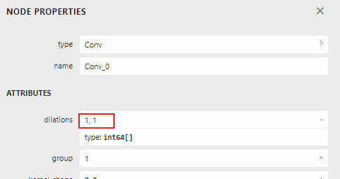

[TOC]

# 前言

- 简介：一套操作简单的onnx改图接口。
- 演进：根据业务需求，功能持续更新和优化中...
- 问题：可能有隐含bug，欢迎使用并告知我修复。

# 依赖

- python==3.8.5
- onnx==1.8.1
- onnxruntime==1.7.0
- skl2onnx==1.8.0
- numpy==1.19.5

# 环境搭建

搭建conda环境：

```shell
conda create -n OXInterface python==3.8.5
conda activate OXInterface
pip install onnx==1.8.1 onnxruntime==1.7.0 skl2onnx==1.8.0 numpy==1.19.5
```

按照此方法搭建环境一定可以用，其它情况不做保证。

# 使用教程

## Example 1：修改Initializer节点的名字

**功能：** 修改Initializer 497的名字（Conv_0下）。

**注意：** 修改Initializer的名字，需要相应修改使用该Initializer的节点的输入。

**示例代码：** 

```python
import os
import onnx
import numpy as np
from pprint import pprint
from OXInterface import OXDataType, OXGraph, OXInitializer, OXNode

oxgraph = OXGraph('./test_model/wide_resnet50_2.onnx')
oxinitializer_497 = oxgraph.get_oxinitializer_by_name('497')
oxinitializer_497.set_name('497_new')
oxnode_conv_0 = oxgraph.get_oxnode_by_name('Conv_0')
oxnode_conv_0.input[1] = '497_new'
oxgraph.save_new_model('./test_model/wide_resnet50_2_example_1.onnx')
```

**修改之后：** 


## Example 2：修改Initializer节点的数据类型

**功能：** 修改Initializer 497的数据类型（Conv_0下），float32改为float16。

**示例代码：** 

```python
import os
import onnx
import numpy as np
from pprint import pprint
from OXInterface import OXDataType, OXGraph, OXInitializer, OXNode

oxgraph = OXGraph('./test_model/wide_resnet50_2.onnx')
oxinitializer_497 = oxgraph.get_oxinitializer_by_name('497')
oxinitializer_497.set_data_type(OXDataType.float16)
oxgraph.save_new_model('./test_model/wide_resnet50_2_example_2.onnx')
```

**修改之前：** 


**修改之后：** 


## Example 3：修改Initializer节点的数据值

**功能：** 修改Initializer 497的数据值（Conv_0下）。

**示例代码：** 

```python
import os
import onnx
import numpy as np
from pprint import pprint
from OXInterface import OXDataType, OXGraph, OXInitializer, OXNode

oxgraph = OXGraph('./test_model/wide_resnet50_2.onnx')
oxinitializer_497 = oxgraph.get_oxinitializer_by_name('497')
new_data = np.array([1, 2, 3, 4], dtype=np.int32)
oxinitializer_497.set_data(new_data)
oxgraph.save_new_model('./test_model/wide_resnet50_2_example_3.onnx')
```

**修改之前：** 


**修改之后：** 


## Example 4：新增Initializer节点

**功能：** 构造并向模型中增加一个新的Initializer。

**说明：** 根据自己需求决定该新Initializer给哪个节点用，示例代码只是构造并向模型中添加了一个Initializer节点，并未指明给哪个节点用，所以打开新模型看不到什么变化。

**示例代码：** 

```python
import os
import onnx
import numpy as np
from pprint import pprint
from OXInterface import OXDataType, OXGraph, OXInitializer, OXNode

oxgraph = OXGraph('./test_model/wide_resnet50_2.onnx')
data = np.array([1, 2, 3, 4], dtype=np.int32)
oxgraph.add_initializer('new_initializer', data)
new_initializer = oxgraph.get_oxinitializer_by_name('new_initializer')
print(new_initializer)
oxgraph.save_new_model('./test_model/wide_resnet50_2_example_4.onnx')
```

## Example 5：保存Initializer节点的数据

**功能：** 保存Initializer 497的数据（Conv_0下）。

**示例代码：** 

```python
import os
import onnx
import numpy as np
from pprint import pprint
from OXInterface import OXDataType, OXGraph, OXInitializer, OXNode

oxgraph = OXGraph('./test_model/wide_resnet50_2.onnx')
oxinitializer_497 = oxgraph.get_oxinitializer_by_name('497')
oxinitializer_497.save_data('./initializer_497.npy')
```

## Example 6：插入节点

**功能：** 向模型中插入节点。

**函数：**

- `insert_node`函数插入节点，并自动连边。无法涵盖所有场景，若结果不符合预期，请用`add_node`函数，并手动指定连边关系。
- `add_node`函数只能插入节点，但无法自动连边。需要结合模型图分析连边关系，并手动连边。

### Sub Example 1

**功能：** 插入单输入单输出节点。在`Relu_1`和`MaxPool_2`之间插入一个`Cast`节点。

**示例代码：** 

```python
import os
import onnx
import numpy as np
from pprint import pprint
from OXInterface import OXDataType, OXGraph, OXInitializer, OXNode

oxgraph = OXGraph('./test_model/wide_resnet50_2.onnx')
oxgraph.insert_node(bef_node_info_list=['Relu_1:0'],
                    aft_node_info_list=['MaxPool_2:0'],
                    op_type='Cast',
                    op_name='Cast1',
                    to=int(OXDataType.float16))
oxgraph.save_new_model('./test_model/wide_resnet50_2_example_6_1.onnx')
```

**参数说明：** 

- `bef_node_info_list`指定了插入节点的前驱节点；
- `aft_node_info_list`指定了插入节点的后继节点；
- `Relu_1:0`中的`:0`表示`Cast1`的输入要连接`Relu_1`的第`0`个输出；
- `MaxPool_2:0`中的`:0`表示`Cast1`的输出要连接`MaxPool_2`的第`0`个输入；
- 若连边是`:0`，则可以省略，其它情况不可省略。例如`:1`或`:0:1`等就不能省略。简化后为：`bef_node_info_list=['Relu_1']`，`aft_node_info_list=['MaxPool_2']`。

**修改之后：** 


### Sub Example 2

**功能：** 插入多输入多输出节点。在`Conv_7`、`Conv_8`和`Add_9`之间插入一个新节点。

**示例代码：** 

```python
import os
import onnx
import numpy as np
from pprint import pprint
from OXInterface import OXDataType, OXGraph, OXInitializer, OXNode

oxgraph = OXGraph('./test_model/wide_resnet50_2.onnx')
oxgraph.insert_node(bef_node_info_list=['Conv_7', 'Conv_8'],
                    aft_node_info_list=['Add_9:0:1'],
                    op_type='Add',
                    op_name='Add_New')
oxgraph.save_new_model('./test_model/wide_resnet50_2_example_6_2.onnx')
```

**参数说明：** 

- `Add_9:0:1`指示`Add_New`的输出同时连接到`Add_9`的第`0`和输入和第`1`个输入上。

**修改之后：** 


### Sub Example 3

**功能：** 插入多输入多输出节点。在`Relu_6`、`MaxPool_2`、`Conv_7`和`Conv_8`之间插入一个新节点。

**示例代码：** 

```python
import os
import onnx
import numpy as np
from pprint import pprint
from OXInterface import OXDataType, OXGraph, OXInitializer, OXNode

oxgraph = OXGraph('./test_model/wide_resnet50_2.onnx')
oxgraph.insert_node(bef_node_info_list=['Relu_6', 'MaxPool_2'],
                    aft_node_info_list=['Conv_7', 'Conv_8'],
                    op_type='Add',
                    op_name='Add_New')
oxgraph.save_new_model('./test_model/wide_resnet50_2_example_6_3.onnx')
```

**修改之后：** 


### Sub Example 4

**功能：** 在输入节点和`Conv_0`之间插入一个`Cast`节点。

**示例代码：** 

```python
import os
import onnx
import numpy as np
from pprint import pprint
from OXInterface import OXDataType, OXGraph, OXInitializer, OXNode

oxgraph = OXGraph('./test_model/wide_resnet50_2.onnx')
oxgraph.insert_node(
    bef_node_info_list=['image'],
    aft_node_info_list=['Conv_0'],
    op_type='Cast',
    op_name='Cast1',
    to=int(OXDataType.float16),
)
oxgraph.save_new_model('./test_model/wide_resnet50_2_example_6_4.onnx')
```

**修改之后：**


### Sub Example 5

**功能：** 在` Gemm_121 `和输出节点之间插入一个`Cast`节点。

**示例代码：** 

```python
import os
import onnx
import numpy as np
from pprint import pprint
from OXInterface import OXDataType, OXGraph, OXInitializer, OXNode

oxgraph = OXGraph('./test_model/wide_resnet50_2.onnx')
oxgraph.insert_node(bef_node_info_list=['Gemm_121'],
                    aft_node_info_list=['class'],
                    op_type='Cast',
                    op_name='Cast1',
                    to=int(OXDataType.float16))
oxgraph.save_new_model('./test_model/wide_resnet50_2_example_6_5.onnx')
```

**修改之后：**


### Sub Example 6

**功能：** 自己手动连边。在` Relu_1`和` MaxPool_2`之间插入一个`Reshape`节点（需要结合模型图分析连边关系）。

**示例代码：** 

```python
import os
import onnx
import numpy as np
from pprint import pprint
from OXInterface import OXDataType, OXGraph, OXInitializer, OXNode

oxgraph = OXGraph('./test_model/wide_resnet50_2.onnx')

# 构造一个常量节点
oxgraph.add_initializer('Initializer_New', np.array([1, 2, 3, 4], dtype=np.int32))

# 增加一个Reshape节点
# Reshape_New的一个输入接Relu_1的输出，另个输入接Initializer_New
# Reshape_New的输入设定为Reshape_New_0（也可以是其它名字）
oxgraph.add_node(op_type='Reshape', op_name='Reshape_New', inputs=['323', 'Initializer_New'], outputs=['Reshape_New_0'])

# MaxPool_2的第一个输入接Reshape_New的输出Reshape_New_0
MaxPool_2 = oxgraph.get_oxnode_by_name('MaxPool_2')
MaxPool_2.input[0] = 'Reshape_New_0'

# 保存模型
oxgraph.save_new_model('./test_model/wide_resnet50_2_example_6_6.onnx')
```

**修改之后：**


## Example 7：截取模型

**功能：** 截取模型。

**用途：** 可以用来单独验证某段网络的精度。

**说明：**

- `trunc_model`函数使用节点名指定截图的范围；
- `extract_model`函数使用tensor名指定截图的范围。

### Sub Example 1

**功能：** 截取`Add_9`单节点。

**示例代码：** 

```python
import os
import onnx
import numpy as np
from pprint import pprint
from OXInterface import OXDataType, OXGraph, OXInitializer, OXNode

oxgraph = OXGraph('./test_model/wide_resnet50_2.onnx')
oxgraph.trunc_model(
    trunc_beg_node_name_list=['Add_9'],
    trunc_end_node_name_list=['Add_9'],
    new_model_save_path='./test_model/wide_resnet50_2_example_7_1.onnx',
)
```

**截取之后：** 


### Sub Example 2

**功能：** 截取`Add_9`到`Add_16`之间的网络。

**示例代码：** 

```python
import os
import onnx
import numpy as np
from pprint import pprint
from OXInterface import OXDataType, OXGraph, OXInitializer, OXNode

oxgraph = OXGraph('./test_model/wide_resnet50_2.onnx')
oxgraph.trunc_model(
    trunc_beg_node_name_list=['Add_9'],
    trunc_end_node_name_list=['Add_16'],
    new_model_save_path='./test_model/wide_resnet50_2_example_7_2.onnx',
)
```

**截取之后：** 


### Sub Example 3

**功能：** 截取一段网络（开始节点为多个，结束节点为多个）。

**示例代码：** 

```python
import os
import onnx
import numpy as np
from pprint import pprint
from OXInterface import OXDataType, OXGraph, OXInitializer, OXNode

oxgraph = OXGraph('./test_model/wide_resnet50_2.onnx')
oxgraph.trunc_model(
    trunc_beg_node_name_list=['Conv_3', 'Conv_8'],
    trunc_end_node_name_list=['Add_16', 'Conv_13'],
    new_model_save_path='./test_model/wide_resnet50_2_example_7_3.onnx',
)
```

**截取之后：** 


### Sub Example 4

**功能：** 截取一段网络（开始节点为多个，结束节点为多个），并保留Initializer输入。

**示例代码：** 

```python
import os
import onnx
import numpy as np
from pprint import pprint
from OXInterface import OXDataType, OXGraph, OXInitializer, OXNode

oxgraph = OXGraph('./test_model/wide_resnet50_2.onnx')
oxgraph.trunc_model(
    trunc_beg_node_name_list=['Conv_3', 'Conv_8'],
    trunc_end_node_name_list=['Add_16', 'Conv_13'],
    new_model_save_path='./test_model/wide_resnet50_2_example_7_4.onnx',
    keep_input_initializer=True
)
```

**说明：**`Conv_3`和`Conv_8`每个节点都有三个输入，但其中两个输入都是常量节点（Initializer），指定`keep_input_initializer=True`参数保留这些常量输入。与**Sub Example 3**对比看区别。

**截取之后：** 


### Sub Example 5

**功能：** 对于比较复杂的截图需求，由用户自己提供截图信息。

**示例代码：** 

```python
import os
import onnx
import numpy as np
from pprint import pprint
from OXInterface import OXDataType, OXGraph, OXInitializer, OXNode

oxgraph = OXGraph('./test_model/wide_resnet50_2.onnx')
oxgraph.trunc_model(
    trunc_beg_node_name_list=['Conv_3', 'Add_9'],
    trunc_end_node_name_list=['Conv_101', 'Conv_102'],
    new_model_save_path='./test_model/wide_resnet50_2_example_7_5.onnx',
    userdef_trunc_beg_node_info_list=
    [
        {
            'trunc_beg_node_name': 'Conv_3',
            'new_input_info_list': [
                {
                    'input_name': 'new_input_1',
                    'dtype': OXDataType.float32,
                    'shape': ('-1', 64, 56, 56),
                    'input_idx': 0
                }
            ]
        },
        {
            'trunc_beg_node_name': 'Add_9',
            'new_input_info_list': [
                {
                    'input_name': 'new_input_2',
                    'dtype': OXDataType.float32,
                    'shape': ('-1', 256, 56, 56),
                    'input_idx': 1
                }
            ]
        }
    ]
)
```

**参数说明：** 

- `'input_idx': 0`指定`new_input_1`作为`Conv_3`的第一个输入；
- `'input_idx': 1`指定`new_input_2`作为`Add_9`的第二个输入；
- `'-1'`：其实是字符串`-1`而不是数字`-1`，也可以是其它任何字符串，比如`'batch_size'`。字符串表示这是动态shape，如果是静态shape，用数字而非字符串，e.g. `'shape': (1, 256, 56, 56)`。模型tensor的shape信息可参考`Example 8`获取。
- `dtype`：表示数据类型，对应onnx支持的数据类型，这里定义了枚举`OXDataType`，方便用户使用。

**分析：** 

开始节点为`Conv_3`和` Add_9`这种类型，自动截图会产生错误的图形，需要用户自己指定截图信息。因为，如果是自动截图，代码判断`Conv_3`节点除常量节点（Initializer）`500`和`501`后，还需要生成一个输入，那么就生成了`new_input_1`这个输入；代码判断`Add_9`有两个输入，因此会自动生成`new_input_2`和`new_input_3`两个输入，然而，`Add_9`的一个输入是`Conv_3`这半边`Conv_7`的输出，那么其实这个自动生成的`new_input_2`是多余的，就会产生错误的图形。

**截取之后前边：** 


**截取之后后边：** 


### Sub Example 6

**功能：** 使用官方提供的`extract_model`函数截图。

**示例代码：** 

```python
import os
import onnx
import numpy as np
from pprint import pprint
from OXInterface import OXDataType, OXGraph, OXInitializer, OXNode

oxgraph = OXGraph('./test_model/wide_resnet50_2.onnx')
oxgraph.extract_model(
    input_tensor_name_list=['323'],
    output_tensor_name_list=['335'],
    new_model_save_path='./test_model/wide_resnet50_2_example_7_6.onnx')
```

**截取之后：**


## Example 8：获取shape信息

### Sub Example 1

**功能：** 获取模型输入、输出、中间tensor、Initializer的信息（包括：tensor名字、shape、类型）。

**用途举例：** om的`GatherV2D`算子的`indices`不支持`-1`输入，若onnx中`Gather`算子的`indices`为`-1`，则需要根据获取到的tensor信息修改`indices`的值。

**示例代码：** 

```python
import os
import onnx
import numpy as np
from pprint import pprint
from OXInterface import OXDataType, OXGraph, OXInitializer, OXNode

oxgraph = OXGraph('./test_model/wide_resnet50_2.onnx')
pprint(oxgraph.get_input_tensor_info())
pprint(oxgraph.get_output_tensor_info())
pprint(oxgraph.get_all_tensor_info())
```

### Sub Example 2

**功能：** 推导模型各个算子的输出shape信息。

**用途：** 有些模型从onnx图中无法看出算子输出shape信息，也无法获取shape信息，通过此函数可以推导出shape信息。

**原理：** 用真实数据运行一遍模型，记录各个算子的输出shape信息。

**示例代码：** 

```python
import os
import onnx
import numpy as np
from pprint import pprint
from OXInterface import OXDataType, OXGraph, OXInitializer, OXNode

oxgraph = OXGraph('./test_model/wide_resnet50_2.onnx')
infer_tensor_info = oxgraph.infer_shape(input_data_info_list=[{
    'model_input_name': 'image',
    'shape': '(1, 3, 224, 224)',
    'dtype': 'np.float32'
}])
print(infer_tensor_info)
```

## Example 9：dump模型所有节点的数据

**功能：** dump模型所有节点的数据。

**用途：** 精度分析。

**示例代码：** 

```python
import os
import onnx
import numpy as np
from pprint import pprint
from OXInterface import OXDataType, OXGraph, OXInitializer, OXNode

oxgraph = OXGraph('./test_model/wide_resnet50_2.onnx')
input_data = np.random.rand(1, 3, 224, 224).astype(np.float32)
np.save('./input.npy', input_data)
oxgraph.dump_all_node_data(
    input_data_info_list=
    [
        {
            'model_input_name': 'image',
            'npy_file_path': './input.npy',
        }
    ],
    dump_data_save_path='./dump_data'
)
os.remove('./input.npy')
```

**dump数据：** 


## Example 10：新增，删除，修改节点属性

### Sub Example 1

**功能：** 修改`Conv_0`的`dilations`属性。

**示例代码：** 

```python
import os
import onnx
import numpy as np
from pprint import pprint
from OXInterface import OXDataType, OXGraph, OXInitializer, OXNode

oxgraph = OXGraph('./test_model/wide_resnet50_2.onnx')
oxnode = oxgraph.get_oxnode_by_name('Conv_0')
oxnode.set_attribute(attr_name='dilations', attr_value=[2, 2])
oxgraph.save_new_model('./test_model/wide_resnet50_2_example_10_1.onnx')
```

**修改之前：**



**修改之后：**


### Sub Example 2

**功能：** 给`Conv_0`增加一个属性。

**示例代码：** 

```python
import os
import onnx
import numpy as np
from pprint import pprint
from OXInterface import OXDataType, OXGraph, OXInitializer, OXNode

oxgraph = OXGraph('./test_model/wide_resnet50_2.onnx')
oxnode = oxgraph.get_oxnode_by_name('Conv_0')
attr = oxnode.add_attribute(attr_name='new_attr', attr_value=[0, 0])
oxgraph.save_new_model('./test_model/wide_resnet50_2_example_10_2.onnx')
```

**修改之后：**


### Sub Example 3

**功能：** 删除`Conv_0`的一个属性。

**示例代码：** 

```python
import os
import onnx
import numpy as np
from pprint import pprint
from OXInterface import OXDataType, OXGraph, OXInitializer, OXNode

oxgraph = OXGraph('./test_model/wide_resnet50_2.onnx')
oxnode = oxgraph.get_oxnode_by_name('Conv_0')
attr = oxnode.remove_attribute('dilations')
oxgraph.save_new_model('./test_model/wide_resnet50_2_example_10_3.onnx')
```

**修改之前：**


**修改之后：**


## Example 11：删除节点

**功能：** 从模型中删除节点。

**限制：** 若开启自动连边，则删除的节点必须只有一个前驱节点，否则需要手动连边。另外，若结果不符合预期，也需要自己手动连边。

### Sub Example 1

**功能**： 删除`Relu_1`并自动连边（`Relu_1`为单输入，单输出）。

**示例代码：**

```python
import os
import onnx
import numpy as np
from pprint import pprint
from OXInterface import OXDataType, OXGraph, OXInitializer, OXNode

oxgraph = OXGraph('./test_model/wide_resnet50_2.onnx')
oxgraph.remove_node('Relu_1')
oxgraph.save_new_model('./test_model/wide_resnet50_2_example_11_1.onnx')
```

### Sub Example 2

**功能**： 删除`Relu_10`并自动连边（`Relu_10`为单输入，多输出）。

**示例代码：**

```python
import os
import onnx
import numpy as np
from pprint import pprint
from OXInterface import OXDataType, OXGraph, OXInitializer, OXNode

oxgraph = OXGraph('./test_model/wide_resnet50_2.onnx')
oxgraph.remove_node('Relu_10')
oxgraph.save_new_model('./test_model/wide_resnet50_2_example_11_2.onnx')
```

### Sub Example 3

**功能**： 删除`Add_9`和` Relu_10`并手动连边（需要结合模型图查看节点关系）。

**示例代码：**

```python
import os
import onnx
import numpy as np
from pprint import pprint
from OXInterface import OXDataType, OXGraph, OXInitializer, OXNode

oxgraph = OXGraph('./test_model/wide_resnet50_2.onnx')

# 删除节点
oxgraph.remove_node('Add_9', auto_link=False)
oxgraph.remove_node('Relu_10', auto_link=False)

# 获取删除节点的前后节点
Conv_7 = oxgraph.get_oxnode_by_name('Conv_7')
Conv_8 = oxgraph.get_oxnode_by_name('Conv_8')
Add_16 = oxgraph.get_oxnode_by_name('Add_16')
Conv_11 = oxgraph.get_oxnode_by_name('Conv_11')

# 自定义连边
# Add_16的第1个输入接Conv_7的第0个输出
# Conv_11的第0个输入接Conv_8的第0个输出
Add_16.input[1] = Conv_7.output[0]
Conv_11.input[0] = Conv_8.output[0]

oxgraph.save_new_model('./test_model/wide_resnet50_2_example_11_3.onnx')
```

**删除之前：**


**删除之后：**


